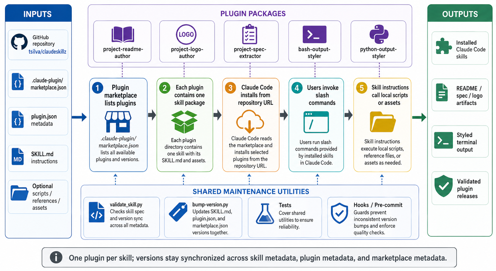

<div align="center">
  

  **🔧 Modular skills that supercharge Claude Code with specialized capabilities ⚡**
</div>

claudeskillz is a Claude Code plugin repository for installing a curated set of agent skills. Each plugin contains one skill, its metadata, and any scripts, references, or assets the skill needs.

Use it to add reusable README, logo, spec extraction, and terminal-output styling workflows to Claude Code, or as a reference for maintaining your own skill plugins.

## Install

Install the plugin collection in Claude Code:

```bash
claude plugins:add tsilva/claudeskillz
```

Or add the repository URL through `Settings -> Plugins -> Add from URL`:

```text
https://github.com/tsilva/claudeskillz
```

After installation, invoke a skill from Claude Code with its slash command, such as `/project-readme-author`.

For local development:

```bash
git clone https://github.com/tsilva/claudeskillz.git
cd claudeskillz
uv sync --extra dev
uv run pytest
```

## Available Skills

- `project-readme-author` v2.6.1: creates, modifies, validates, and optimizes README files.
- `project-logo-author` v6.0.0: generates project logos with transparent backgrounds using `repologogen`.
- `project-spec-extractor` v1.0.0: extracts a codebase into a pure requirements specification.
- `bash-output-styler` v2.0.0: applies reusable terminal styling to bash scripts with `gum` and ANSI fallback.
- `python-output-styler` v1.0.0: applies reusable terminal styling to Python scripts with Rich and plain-text fallback.

## Commands

```bash
claude plugins:add tsilva/claudeskillz                         # install the plugin collection
uv run pytest                                                  # run the shared utility tests
uv run shared/validate_skill.py plugins/<plugin>/skills/<skill> # validate one skill package
uv run shared/bump-version.py <plugin> --type patch            # bump plugin, skill, and marketplace versions
```

## Notes

- Plugin metadata lives in `.claude-plugin/marketplace.json` and `plugins/*/.claude-plugin/plugin.json`.
- Skill instructions live in `plugins/*/skills/*/SKILL.md`.
- Any change inside `plugins/*/` needs a version bump across `SKILL.md`, `plugin.json`, and `marketplace.json`.
- Shared utilities are dependency-light Python scripts designed to run with `uv`.
- The pre-commit hook validates staged plugin version bumps before commit.

## Architecture



## License

[MIT](LICENSE)
