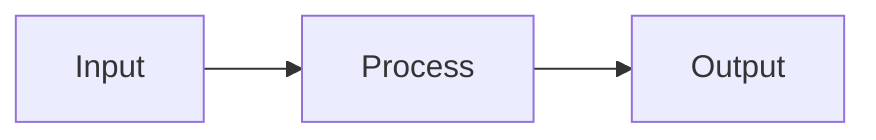

# README Author

Create READMEs that hook readers in 5 seconds, prove value in 30 seconds, and enable success in under 10 minutes.

## Operations

| Operation | Triggers | Purpose |
|-----------|----------|---------|
| **create** | No README exists, "create/generate README" | Build from scratch |
| **modify** | README exists, "update/change README" | Preserve structure, update sections |
| **validate** | "check/review/audit README" | Score against best practices |
| **optimize** | "improve/enhance README" | Fix issues, enhance quality |

### Operation Detection

1. **Check `$ARGUMENTS`** for explicit operation (e.g., `/readme-author validate`)
2. **Check if README.md exists** at the target path
3. **Analyze user intent** from keywords in their request
4. **Default behavior**: `create` if no README exists, `modify` if README exists

---

## Create Operation

Use when building a README from scratch. Follow the Core Framework and Workflow sections below.

## Modify Operation

Use when updating an existing README while preserving its structure.

### Preservation Rules

1. **Keep custom prose** - User-written descriptions, explanations, and context
2. **Update dynamic content** - Versions, badge URLs, install commands
3. **Respect markers** - Content within `<!-- custom -->...<!-- /custom -->` is never touched
4. **Preserve section order** - Don't reorder sections unless explicitly requested

### Merge Strategy

| Content Type | Action |
|--------------|--------|
| User-written prose | Preserve exactly |
| Version numbers | Update to current |
| Badge URLs | Refresh if broken |
| Code examples | Update if outdated |
| New sections | Add at appropriate location |
| Deprecated sections | Flag for user review |

### Detection of Manual Edits

Look for these signals that content is hand-crafted:
- `<!-- custom -->` markers
- Non-standard section names
- Prose that doesn't match generated patterns
- Comments like `<!-- keep this -->`

When in doubt, preserve existing content and ask the user.

## Validate Operation

Score an existing README against best practices checklists.

### Scoring Output Format

```
README Validation Report
========================

Overall Score: 72/100 (Professional)

ESSENTIAL (Required) - 6/7 passed
  ✅ Project logo present
  ✅ Badges (5 found)
  ✅ One-liner description
  ❌ GIF/screenshot missing
  ✅ Installation command
  ✅ Code example
  ✅ License info

PROFESSIONAL - 4/6 passed
  ✅ Table of contents
  ✅ Feature highlights
  ❌ Multiple install methods
  ✅ Documentation links
  ✅ Contributing section
  ❌ "Used by" logos

ELITE - 1/6 passed
  ❌ Dark/light mode images
  ❌ Architecture diagram
  ❌ Benchmark comparisons
  ❌ FAQ section
  ✅ Star history graph
  ❌ Contributor avatars

Recommendations:
1. Add a GIF demo showing core functionality
2. Include installation options for npm, yarn, and pnpm
3. Add "Used by" section with company logos
```

### Scoring Tiers

| Tier | Score Range | Meaning |
|------|-------------|---------|
| Essential | 0-50 | Missing critical elements |
| Professional | 51-80 | Solid README, room for improvement |
| Elite | 81-100 | Exceptional, comprehensive README |

### Project-Type Specific Checks

For CLI tools, also check:
- [ ] Terminal GIF demo
- [ ] Cross-platform installation matrix
- [ ] Shell integration instructions

For AI/ML projects, also check:
- [ ] Model card with YAML metadata
- [ ] Hardware requirements table
- [ ] Citation in BibTeX format

## Optimize Operation

Automatically improve README quality with quick wins and suggested enhancements.

### Quick Wins (Auto-Apply)

These improvements are safe to apply automatically:
- Center hero section if not centered
- Add alt text to images missing it
- Fix broken badge URLs (shields.io format)
- Add table of contents if >500 words
- Standardize badge style (all flat, all flat-square, etc.)
- Fix heading hierarchy (no skipped levels)

### Requires Approval

These changes need user confirmation:
- Add new sections (Features, FAQ, etc.)
- Rewrite tagline
- Change badge selection
- Add/remove emojis
- Restructure content order

### Optimization Output

```
README Optimization
===================

Auto-Applied (3 changes):
  ✓ Centered hero section
  ✓ Added alt text to logo
  ✓ Fixed badge URL (codecov)

Suggested Changes (requires approval):
  ? Add table of contents [y/n]
  ? Add "Used by" section placeholder [y/n]
  ? Update tagline to include emoji [y/n]
```

---

## Core Framework: Hook → Prove → Enable → Extend

Every README follows this psychological progression:

| Phase | Time | Purpose | Elements |
|-------|------|---------|----------|
| **Hook** | 0-5 sec | Instant recognition | Logo + badges + one-liner + demo visual |
| **Prove** | 5-30 sec | Build credibility | Social proof, features, trust signals |
| **Enable** | 30 sec - 10 min | Immediate success | One-liner install + working example |
| **Extend** | Committed users | Deep engagement | Docs links, contributing, API reference |

**The goal: Time to first success under 10 minutes.**

The first 5-10 lines visible without scrolling determine whether users stay or leave.

## Logo Generation (Mandatory)

Every README must have a logo. Follow this process:

### Step 1: Check for Existing Logo

Look for `logo.png` at the repo root. If found, use it and skip to README generation.

### Step 2: Generate Logo (if missing)

Invoke the **logo-generator** skill to generate a logo. That skill contains the prompt templates, visual metaphors, and technical requirements for logo generation.

### Step 3: Determine Logo Display Size

For crisp display on retina/high-DPI screens, set the HTML width to **half the actual image width**:

1. Get the image dimensions using `mcp__image-tools__get_image_metadata`:
   - `image_path`: absolute path to the logo file

2. Extract the width from the returned metadata

3. Divide by 2 for the display width (e.g., 1024px image → `width="512"`)

4. Use the calculated width in the HTML img tag

This ensures the logo renders at native resolution on 2x displays while maintaining appropriate size on standard displays.

### Dark/Light Mode Support

For theme-aware logos, use the `<picture>` element:

```html
<picture>
  <source media="(prefers-color-scheme: dark)" srcset="logo-dark.png">
  <source media="(prefers-color-scheme: light)" srcset="logo-light.png">
  
</picture>
```

## Hero Section

The hero section is the most critical part of the README. It must be center-aligned and contain these elements in order:

### Title Rule

**The title must be exactly the same as the repository name.** Preserve the original casing and formatting:
- If the repo is `my-awesome-tool`, the title is `my-awesome-tool` (not "My Awesome Tool")
- If the repo is `fastAPI`, the title is `fastAPI` (not "FastAPI" or "Fastapi")
- If the repo is `README-Generator`, the title is `README-Generator`

Do not "prettify" or transform the repo name. Use it verbatim as the H1 title.

```markdown
<div align="center">
  

  [](link) [](link) [](link)

  **A clear, catchy one-liner that explains what this does and why it matters**

  [Documentation](url) · [Demo](url) · [Discord](url)
</div>
```

### Hero Element Requirements

| Element | Specification |
|---------|---------------|
| Logo | Width = half actual pixels (for retina), centered |
| Badges | 3-6 maximum, shields.io for consistency |
| Tagline | One sentence with emoji(s), max 350 chars (fits GitHub "About" field) |
| Quick links | Docs, demo, community (if available) |

### Tagline Patterns That Work

**Rules:**
- **Must include emoji(s)** - 1-3 relevant emojis that reinforce the message
- **Max 350 characters** - fits GitHub's "About → Description" field
- **Ideal length: 80-150 chars** - punchy and scannable

Good taglines lead with benefits, not features:

- ✅ "🔧 Magnificent app which corrects your previous console command"
- ✅ "⚡ High-performance, easy to learn, fast to code, ready for production"
- ✅ "🚀 A blazing fast CLI for X"
- ✅ "🛠️ Build, test, and deploy with zero config"
- ❌ "A Python library for doing Y" (no emoji, too generic)
- ❌ "Version 2.0 of the Z project" (no emoji, self-focused)

### GIF Demo Placement

For CLI tools, place an animated GIF demo **immediately after the tagline**. This is the single most distinctive pattern across successful CLI projects (thefuck, lazygit, fzf, bat).

## Badges

Use 4-7 badges in this priority order:

1. **Build/CI status** - project health
2. **Code coverage** - quality signal
3. **Version/release** - active development
4. **License** - legal clarity
5. **Downloads** - adoption proof
6. **Discord/community** - engagement signal

### Badge Implementation

```markdown
[](link)
[](link)
[](link)
[](link)
[](link)
[](link)
```

**Rules:**
- Use shields.io for all badges (consistent styling)
- Pick one style (flat, flat-square, for-the-badge) and use it consistently
- For CLI tools, include a Repology badge showing packaging status

## Visual Elements

### GIF Demos (Mandatory for CLI Tools)

Terminal recordings are mandatory for CLI tools. Use:
- **vhs** - scripted terminal GIFs (recommended)
- **terminalizer** - interactive recording
- **asciinema** - terminal session sharing

**GIF Requirements:**
- Under 10MB (GitHub limit)
- 10-15fps is sufficient
- Show the "aha moment" - core value in action
- Drag-drop into README editor to host on GitHub's CDN

### Screenshots

For UI-heavy projects:
- Include both light and dark mode versions
- Compress before adding (ImageOptim, XConvert)
- Use descriptive alt text

### Tables

Use tables for:
- Feature comparisons
- API parameters
- Benchmark results
- Installation matrices (cross-platform)

### Architecture Diagrams

For complex projects, use Mermaid (GitHub-native):

```markdown

```

## Writing Style

### Voice and Tone

- **Active voice, imperative mood**: "Install the package" not "The package can be installed"
- **Second person**: "You can configure..." not "Users can configure..."
- **Present tense**: "This library handles..." feels immediate
- **Contractions**: "don't," "it's," "you'll" create conversational tone

### Structure

- Maximum 3-5 lines per paragraph
- One concept per paragraph
- 80-character line width for readability

### Emoji Strategy

Strategic emojis boost engagement:

| Location | Examples | Purpose |
|----------|----------|---------|
| Section headers | 🚀 Quick Start, ⚙️ Config, 📦 Install | Visual navigation |
| Feature bullets | ✨ New, ⚡ Fast, 🔒 Secure | Scannable benefits |
| Status indicators | ✅ Done, ⏳ WIP, ❌ Deprecated | Quick comprehension |
| CTAs | ⭐ Star us!, 🤝 Contribute | Engagement boost |

**Rules**: 1-2 per section max. Never in code blocks. Consistent style throughout.

### Anti-Pattern

Focus on user benefits, not project history or developer achievements. The README is for users, not a changelog.

## Engagement Boosters

### Humor That Works

Subtle, inclusive humor increases engagement:
- **Self-aware**: "Yes, another X. But hear us out..."
- **Relatable pain**: "We got tired of Y, so we built this"
- **Easter eggs**: Hidden features for curious readers

Avoid: Dated memes, inside jokes, anything requiring context.

## README by Project Type

For detailed templates and examples by project type (AI/ML, CLI, Libraries, Web Apps), see [references/project-types.md](references/project-types.md).

## Social Proof

### "Used By" Section

Place prominently after hero section with 6-12 company logos:

```markdown
## Used By

<p align="center">
  
  &nbsp;&nbsp;&nbsp;
  
</p>
```

### Star CTA

Engaging call-to-action patterns:
- `⭐ Star if this saved you hours of debugging!`
- `🌟 If this helped, a star would make our day!`

**Rules**: One CTA max. Humor optional but never cringe. Self-deprecation > bragging.

### Community Links

```markdown
[](link)
[](link)
```

### Supporting Files

These files signal project maturity:
- CONTRIBUTING.md
- CODE_OF_CONDUCT.md
- SECURITY.md
- LICENSE

## Anti-Patterns

Avoid these mistakes:

| Anti-Pattern | Problem |
|--------------|---------|
| No README or empty README | Single worst error |
| Wall of text | No structure, long paragraphs |
| Missing install instructions | Users immediately lost |
| Scary build instructions upfront | `git clone; cmake...` scares users |
| No visual demonstration | Text-only descriptions of visual software |
| Outdated information | Erodes trust |
| API-dump documentation | README shouldn't be complete API reference |
| Redundant information | Repeating title (already in URL) |
| Inconsistent formatting | Mixed badge styles, varying headers |
| Self-focused writing | Developer achievements over user benefits |
| Emoji overload 🎉🚀✨💯🔥 | Visual noise, unprofessional |

## Workflow

### Create Workflow

1. **Analyze project** - scan for package.json, Cargo.toml, pyproject.toml, go.mod, etc.
2. **Detect project type** - CLI, library, AI/ML, web app, API
3. **Extract metadata** - name, description, version, author, license
4. **Check for existing logo** - look for `logo.png` at repo root
5. **Generate logo if missing** - use logo-generator skill
6. **Calculate display width** - use half the actual image pixel width (for retina displays)
7. **Generate README.md** - following Hook → Prove → Enable → Extend structure

### Modify Workflow

1. **Read existing README** - parse structure and content
2. **Identify sections** - map to standard structure
3. **Detect custom content** - look for markers and non-standard prose
4. **Apply requested changes** - update only what was asked
5. **Preserve custom content** - keep user-written sections intact
6. **Validate result** - ensure no broken links or formatting

### Validate Workflow

1. **Read existing README** - parse all content
2. **Run Essential checklist** - mandatory items
3. **Run Professional checklist** - recommended items
4. **Run Elite checklist** - advanced items
5. **Check project-type specifics** - CLI, AI/ML, etc.
6. **Calculate score** - weighted by tier
7. **Generate report** - with actionable recommendations

### Optimize Workflow

1. **Run validation first** - identify issues
2. **Apply quick wins** - safe auto-fixes
3. **Present suggestions** - changes requiring approval
4. **Apply approved changes** - with user confirmation
5. **Re-validate** - show improvement

## Quick Reference Checklist

### Essential (Must Include)

- [ ] Project logo (width = half actual pixels, centered)
- [ ] 4-7 relevant badges
- [ ] One-liner description ("What and why?")
- [ ] GIF/screenshot demonstration
- [ ] One-liner installation command
- [ ] Minimal working code example
- [ ] License information

### Professional Tier

- [ ] Table of contents (if >500 words)
- [ ] Feature highlights with benefits
- [ ] Multiple installation methods
- [ ] Documentation links
- [ ] Contributing section
- [ ] "Used by" company logos

### Elite Tier

- [ ] Dark/light mode image support
- [ ] Architecture diagram
- [ ] Benchmark comparisons
- [ ] FAQ section
- [ ] Star history graph
- [ ] Contributor avatars

### AI/ML Specific

- [ ] Model card with YAML metadata
- [ ] Hardware requirements table
- [ ] Benchmark results with reproducibility
- [ ] Colab/demo links
- [ ] Training vs. inference split
- [ ] Ethical considerations
- [ ] Citation in BibTeX format

### CLI Specific

- [ ] Terminal GIF demo
- [ ] Cross-platform installation matrix
- [ ] Shell integration instructions
- [ ] Configuration file examples
- [ ] Keybinding reference table
- [ ] Performance benchmarks
