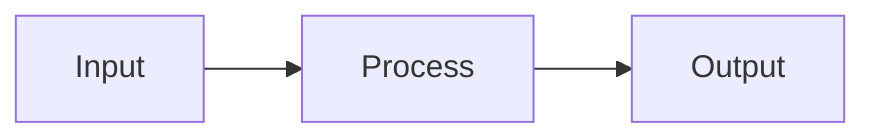

# README Generator

Create READMEs that hook readers in 5 seconds, prove value in 30 seconds, and enable success in under 10 minutes.

## Core Framework: Hook → Prove → Enable → Extend

Every README follows this psychological progression:

| Phase | Time | Purpose | Elements |
|-------|------|---------|----------|
| **Hook** | 0-5 sec | Instant recognition | Logo + badges + one-liner + demo visual |
| **Prove** | 5-30 sec | Build credibility | Social proof, features, trust signals |
| **Enable** | 30 sec - 10 min | Immediate success | One-liner install + working example |
| **Extend** | Committed users | Deep engagement | Docs links, contributing, API reference |

**The goal: Time to first success under 10 minutes.**

The first 5-10 lines visible without scrolling determine whether users stay or leave. Research on 14,901 repositories found that READMEs containing project name, usage information, installation instructions, code snippets, and images correlate significantly with higher star counts.

## Logo Generation (Mandatory)

Every README must have a logo. Follow this process:

### Step 1: Check for Existing Logo

Look for `logo.png` at the repo root. If found, use it and skip to README generation.

### Step 2: Generate Logo (if missing)

Invoke the **repo-logo-generator** skill to generate a logo. That skill contains the prompt templates, visual metaphors, and technical requirements for logo generation.

### Dark/Light Mode Support

For theme-aware logos, use the `<picture>` element:

```html
<picture>
  <source media="(prefers-color-scheme: dark)" srcset="logo-dark.png">
  <source media="(prefers-color-scheme: light)" srcset="logo-light.png">
  
</picture>
```

## Hero Section

The hero section is the most critical part of the README. It must be center-aligned and contain these elements in order:

### Title Rule

**The title must be exactly the same as the repository name.** Preserve the original casing and formatting:
- If the repo is `my-awesome-tool`, the title is `my-awesome-tool` (not "My Awesome Tool")
- If the repo is `fastAPI`, the title is `fastAPI` (not "FastAPI" or "Fastapi")
- If the repo is `README-Generator`, the title is `README-Generator`

Do not "prettify" or transform the repo name. Use it verbatim as the H1 title.

```markdown
<div align="center">
  

  [](link) [](link) [](link)

  **A clear, catchy one-liner that explains what this does and why it matters**

  [Documentation](url) · [Demo](url) · [Discord](url)
</div>
```

### Hero Element Requirements

| Element | Specification |
|---------|---------------|
| Logo | 150-300px width, SVG preferred, centered |
| Badges | 3-6 maximum, shields.io for consistency |
| Tagline | One sentence answering "What and why?" |
| Quick links | Docs, demo, community (if available) |

### Tagline Patterns That Work

Good taglines lead with benefits, not features:

- ✅ "Magnificent app which corrects your previous console command" (thefuck)
- ✅ "High-performance, easy to learn, fast to code, ready for production" (FastAPI)
- ✅ "A blazing fast CLI for X"
- ❌ "A Python library for doing Y" (too generic)
- ❌ "Version 2.0 of the Z project" (self-focused)

### GIF Demo Placement

For CLI tools, place an animated GIF demo **immediately after the tagline**. This is the single most distinctive pattern across successful CLI projects (thefuck, lazygit, fzf, bat).

## Badges

Use 4-7 badges in this priority order:

1. **Build/CI status** - project health
2. **Code coverage** - quality signal
3. **Version/release** - active development
4. **License** - legal clarity
5. **Downloads** - adoption proof
6. **Discord/community** - engagement signal

### Badge Implementation

```markdown
[](link)
[](link)
[](link)
[](link)
[](link)
[](link)
```

**Rules:**
- Use shields.io for all badges (consistent styling)
- Pick one style (flat, flat-square, for-the-badge) and use it consistently
- For CLI tools, include a Repology badge showing packaging status

## Visual Elements

### GIF Demos (Mandatory for CLI Tools)

Terminal recordings are mandatory for CLI tools. Use:
- **vhs** - scripted terminal GIFs (recommended)
- **terminalizer** - interactive recording
- **asciinema** - terminal session sharing

**GIF Requirements:**
- Under 10MB (GitHub limit)
- 10-15fps is sufficient
- Show the "aha moment" - core value in action
- Drag-drop into README editor to host on GitHub's CDN

### Screenshots

For UI-heavy projects:
- Include both light and dark mode versions
- Compress before adding (ImageOptim, XConvert)
- Use descriptive alt text

### Tables

Use tables for:
- Feature comparisons
- API parameters
- Benchmark results
- Installation matrices (cross-platform)

### Architecture Diagrams

For complex projects, use Mermaid (GitHub-native):

```markdown

```

## Writing Style

### Voice and Tone

- **Active voice, imperative mood**: "Install the package" not "The package can be installed"
- **Second person**: "You can configure..." not "Users can configure..."
- **Present tense**: "This library handles..." feels immediate
- **Contractions**: "don't," "it's," "you'll" create conversational tone

### Structure

- Maximum 3-5 lines per paragraph
- One concept per paragraph
- 80-character line width for readability
- Headers with emojis (📚 🚀 ⚙️) improve navigation (use sparingly)

### Anti-Pattern

Focus on user benefits, not project history or developer achievements. The README is for users, not a changelog.

## README by Project Type

### Standard Sections (All Projects)

```markdown
## Overview
Brief explanation of purpose and value proposition.

## Features
- Feature 1 with benefit
- Feature 2 with benefit
- Feature 3 with benefit

## Quick Start
```bash
pip install mypackage
```

```python
from mypackage import Feature
result = Feature().run("input")
print(result)  # Output: "Success"
```

## Installation
Detailed installation for different platforms/methods.

## Usage
Comprehensive examples with code snippets.

## Contributing
How to contribute to the project.

## License
License information and link.
```

### AI/ML Projects

Include these additional sections:

**Model Card (YAML header):**
```yaml
---
language: en
license: mit
library_name: transformers
tags: [text-classification, bert]
datasets: [imdb]
metrics: [accuracy, f1]
base_model: bert-base-uncased
---
```

**Hardware Requirements:**
```markdown
## Requirements
- **GPU**: NVIDIA with CUDA support (8GB+ VRAM)
- **CUDA**: 11.7+
- **RAM**: 16GB+ recommended
```

**Benchmark Table:**

| Model | Dataset | Accuracy | GPU | Training Time |
|-------|---------|----------|-----|---------------|
| Base | SQuAD 2.0 | 83.1% | V100 | 2h 15m |
| Large | SQuAD 2.0 | 87.4% | A100 | 4h 30m |

Include random seeds, batch sizes, and hardware for reproducibility.

**Demo Links:**
```markdown
[](link)
[](link)
```

**Required Ethical Sections:**
- Bias, risks, and limitations
- Out-of-scope uses
- Environmental impact
- Data privacy considerations

**Citation:**
```bibtex
@article{author2024model,
  title={Model Name},
  author={Author, A.},
  year={2024}
}
```

### CLI Tools

**Shell Integration:**
```bash
# Bash
eval "$(myapp init bash)"

# Zsh
eval "$(myapp init zsh)"

# Fish
myapp init fish | source
```

**Cross-Platform Installation Matrix:**

| Platform | Command |
|----------|---------|
| macOS (Homebrew) | `brew install myapp` |
| Linux (apt) | `sudo apt install myapp` |
| Windows (Scoop) | `scoop install myapp` |
| From source | `cargo install myapp` |

**Performance Benchmarks:**

| Tool | Time | Relative |
|------|------|----------|
| myapp | 0.082s | 1.00x |
| alternative1 | 0.273s | 3.34x |
| alternative2 | 0.443s | 5.43x |

Specify exact hardware, scenarios, and equivalent flags for fair comparison.

**Keybinding Reference:**

| Key | Action |
|-----|--------|
| `space` | Stage selected line |
| `CTRL-R` | Search history |

**Configuration Example:**
```toml
# ~/.config/myapp/config
--theme="TwoDark"
--style="numbers,changes,header"
```

### Libraries

**API Reference Table:**

| Method | Parameters | Returns | Description |
|--------|------------|---------|-------------|
| `process()` | `data: str` | `Result` | Process input data |
| `configure()` | `options: dict` | `None` | Set configuration |

**Quick Example:**
```python
from mylib import Thing

thing = Thing()
result = thing.process(data)
```

### Web Apps

**Live Demo Link** prominently placed after hero section.

**Environment Variables Table:**

| Variable | Required | Description |
|----------|----------|-------------|
| `DATABASE_URL` | Yes | Database connection string |
| `API_KEY` | Yes | External API key |

**Docker Quick Start:**
```bash
docker run -p 3000:3000 myapp
```

## Social Proof

### "Used By" Section

Place prominently after hero section with 6-12 company logos:

```markdown
## Used By

<p align="center">
  
  &nbsp;&nbsp;&nbsp;
  
</p>
```

### Star CTA

Tasteful star call-to-action:
```markdown
If this helps you, please ⭐ star the repo!
```

### Community Links

```markdown
[](link)
[](link)
```

### Supporting Files

These files signal project maturity:
- CONTRIBUTING.md
- CODE_OF_CONDUCT.md
- SECURITY.md
- LICENSE

## Anti-Patterns

Avoid these mistakes:

| Anti-Pattern | Problem |
|--------------|---------|
| No README or empty README | Single worst error |
| Wall of text | No structure, long paragraphs |
| Missing install instructions | Users immediately lost |
| Scary build instructions upfront | `git clone; cmake...` scares users |
| No visual demonstration | Text-only descriptions of visual software |
| Outdated information | Erodes trust |
| API-dump documentation | README shouldn't be complete API reference |
| Redundant information | Repeating title (already in URL) |
| Inconsistent formatting | Mixed badge styles, varying headers |
| Self-focused writing | Developer achievements over user benefits |

## Workflow

1. **Analyze project** - scan for package.json, Cargo.toml, pyproject.toml, go.mod, etc.
2. **Detect project type** - CLI, library, AI/ML, web app, API
3. **Extract metadata** - name, description, version, author, license
4. **Check for existing logo** - look for `logo.png` at repo root
5. **Generate logo if missing** - use repo-logo-generator skill
6. **Generate README.md** - following Hook → Prove → Enable → Extend structure

## Quick Reference Checklist

### Essential (Must Include)

- [ ] Project logo (150-300px, centered)
- [ ] 4-7 relevant badges
- [ ] One-liner description ("What and why?")
- [ ] GIF/screenshot demonstration
- [ ] One-liner installation command
- [ ] Minimal working code example
- [ ] License information

### Professional Tier

- [ ] Table of contents (if >500 words)
- [ ] Feature highlights with benefits
- [ ] Multiple installation methods
- [ ] Documentation links
- [ ] Contributing section
- [ ] "Used by" company logos

### Elite Tier

- [ ] Dark/light mode image support
- [ ] Architecture diagram
- [ ] Benchmark comparisons
- [ ] FAQ section
- [ ] Star history graph
- [ ] Contributor avatars

### AI/ML Specific

- [ ] Model card with YAML metadata
- [ ] Hardware requirements table
- [ ] Benchmark results with reproducibility
- [ ] Colab/demo links
- [ ] Training vs. inference split
- [ ] Ethical considerations
- [ ] Citation in BibTeX format

### CLI Specific

- [ ] Terminal GIF demo
- [ ] Cross-platform installation matrix
- [ ] Shell integration instructions
- [ ] Configuration file examples
- [ ] Keybinding reference table
- [ ] Performance benchmarks
